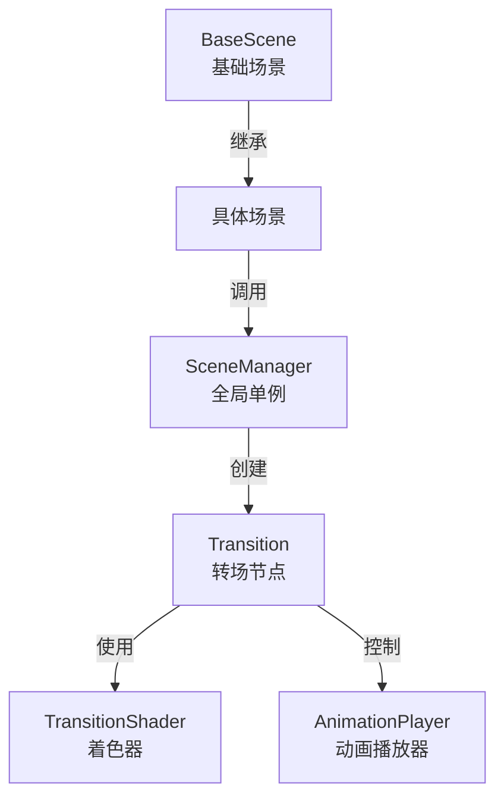
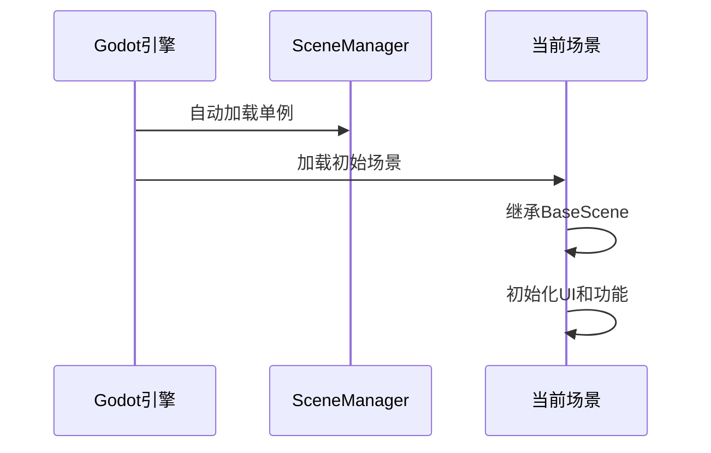
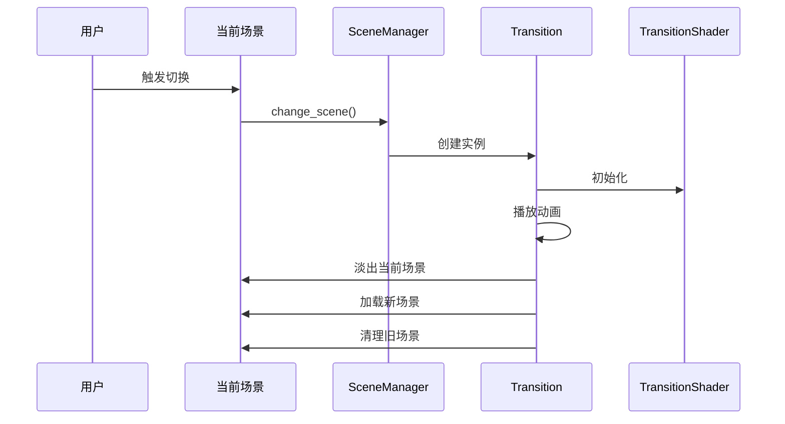

# Godot场景转场系统详细指南

## 一、系统架构

### 1. 核心组件


### 2. 文件结构及作用
```
project/
├── addons/
│   ├── transition.tscn    # 转场场景：包含ColorRect和AnimationPlayer
│   └── transition.gd      # 转场逻辑：控制场景切换和动画播放
├── shaders/
│   └── transition_shader.gdshader  # 着色器：实现视觉效果
├── scenes/
│   ├── base_scene.gd      # 基础场景：提供通用功能
│   └── scene_*.tscn       # 具体场景：继承自base_scene
└── SceneManager.gd        # 场景管理器：全局单例
```

## 二、运行时流程

### 1. 初始化阶段


### 2. 场景切换流程


## 三、核心脚本详解

### 1. SceneManager.gd
```gdscript
extends Node

func change_scene(target: String, pattern: String = "") -> void
```
**运行时作用：**
- 作为自动加载的全局单例存在
- 接收场景切换请求
- 管理转场效果的创建和销毁
- 确保场景切换的线程安全

### 2. transition.gd
```gdscript
extends Node

var is_transitioning: bool = false
var next_scene: String = ""
```
**运行时作用：**
- 控制转场动画的播放
- 管理场景切换状态
- 处理新旧场景的加载和卸载
- 协调着色器参数的更新

### 3. base_scene.gd
```gdscript
extends Node

enum TransitionEffect {
    RADIAL_GLOW,
    HEX_MOSAIC,
    # ...
}
```
**运行时作用：**
- 提供场景切换的统一接口
- 管理转场效果类型
- 处理场景间的导航逻辑
- 维护颜色方案和视觉效果

## 四、实际运行示例

### 1. 基础场景切换
```gdscript
# 在任意继承自BaseScene的场景中
func _on_next_button_pressed():
    # 获取当前场景索引
    var current_index = get_current_scene_index()
    # 计算下一个场景
    var next_index = (current_index + 1) % SCENES.size()
    # 执行带效果的场景切换
    await change_scene_with_effect(
        SCENES[next_index],
        TransitionEffect.RADIAL_GLOW
    )
```

### 2. 自定义效果切换
```gdscript
func custom_transition():
    var color_scheme = color_schemes.pick_random()
    var scene_manager = get_node("/root/SceneManager")
    var transition = await scene_manager.change_scene(
        "res://scenes/custom_scene.tscn"
    )
    
    # 设置自定义效果
    transition\
        .set_effect(TransitionEffect.RAINBOW_WAVE)\
        .set_speed(1.5)\
        .set_color(color_scheme.main)
```

## 五、运行时注意事项

### 1. 性能考虑
- 场景切换时会短暂创建额外的节点
- 着色器效果可能在低端设备上造成性能压力
- 建议在切换时暂停不必要的更新

### 2. 内存管理
- 确保旧场景被正确释放
- 注意资源预加载和缓存
- 监控转场过程中的内存使用

### 3. 错误处理
- 场景加载失败的优雅降级
- 转场动画中断的恢复机制
- 异常状态的清理流程

## 六、调试指南

### 1. 常见问题
1. 场景切换卡顿
   - 检查场景资源大小
   - 确认着色器复杂度
   - 优化资源加载时机

2. 转场效果异常
   - 验证着色器参数
   - 检查动画时间轴
   - 确认材质设置

### 2. 调试输出
```gdscript
# 在transition.gd中
func play_transition(target_scene: String) -> void:
    print("开始转场效果")
    print("目标场景：", target_scene)
    print("当前效果：", current_effect)
```

## 七、扩展建议

### 1. 新增转场效果
1. 在TransitionEffect枚举中添加新类型
2. 在着色器中实现对应效果
3. 在transition.gd中添加参数控制

### 2. 优化建议
1. 实现场景预加载机制
2. 添加转场效果配置文件
3. 支持自定义转场回调

喵~这就是完整的运行时指南啦！每个组件都像齿轮一样精密配合，共同实现流畅的场景切换效果！如果你想了解更多细节，随时问我哦！(=^･ω･^=) 