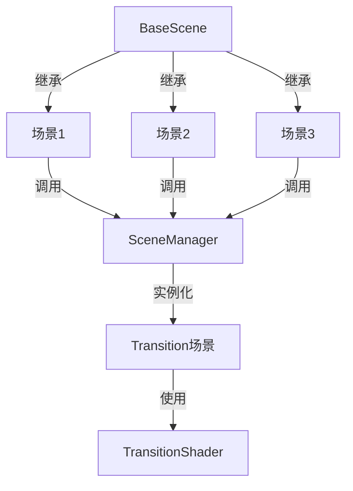
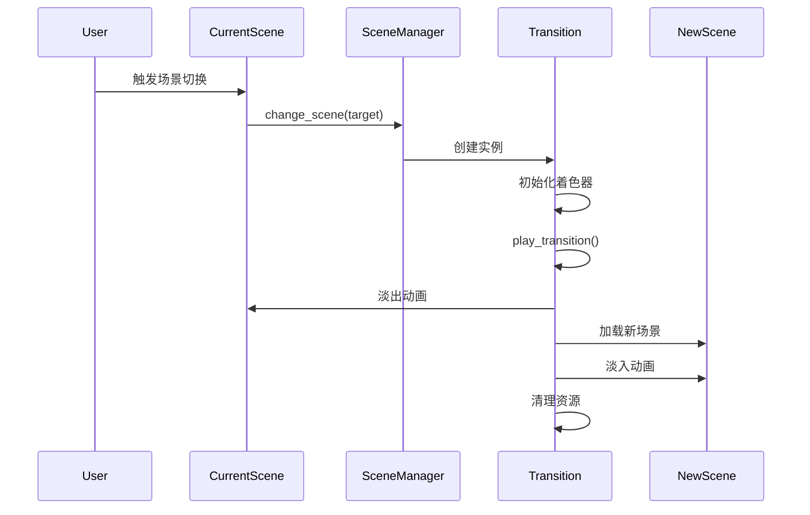

# Godot场景转场效果项目文档

## 项目概述
这是一个基于Godot 4.x开发的场景转场效果项目，实现了场景之间切换时的平滑过渡动画效果。

## 项目结构
```
├── .godot/           # Godot引擎缓存文件
├── addons/          # 转场效果核心插件
│   ├── transition.tscn  # 转场场景
│   └── transition.gd    # 转场逻辑脚本
├── shaders/         # 着色器文件
│   └── transition_shader.gdshader  # 转场效果着色器
├── scenes/          # 场景文件
│   ├── scene_1.tscn     # 示例场景1
│   ├── scene_2.tscn     # 示例场景2
│   ├── scene_3.tscn     # 示例场景3
│   ├── base_scene.gd    # 基础场景脚本
│   └── BaseScence.tscn  # 基础场景模板
└── SceneManager.gd  # 场景管理器
```

## 核心组件关系图


## 函数调用流程

### 1. 场景管理器 (SceneManager.gd)
```gdscript
# 自动加载的单例，负责场景切换
func change_scene(target: String, pattern: String = "") -> void:
    # 1. 创建转场实例
    # 2. 添加到场景树
    # 3. 执行转场动画
```

### 2. 转场效果 (transition.gd)
```gdscript
# 转场效果实现
func play_transition(target: String) -> void:
    # 1. 设置着色器参数
    # 2. 播放动画
    # 3. 切换场景
    # 4. 清理资源
```

### 3. 基础场景 (base_scene.gd)
```gdscript
# 所有场景的基类
func change_to_scene(scene_path: String) -> void:
    # 调用场景管理器进行切换
    SceneManager.change_scene(scene_path)
```

## 函数调用时序图


## 使用示例

### 1. 在场景中添加切换按钮
```gdscript
extends BaseScene

func _on_button_pressed():
    change_to_scene("res://scenes/scene_2.tscn")
```

### 2. 自定义转场效果
```gdscript
# 调用时指定转场模式
SceneManager.change_scene("res://scenes/scene_2.tscn", "fade")
```

## 注意事项
1. 所有场景应继承自BaseScene以获得统一的场景切换功能
2. 转场效果可通过修改shader参数自定义
3. 场景切换时会自动处理资源的加载和释放

## 开发建议
1. 使用统一的场景切换接口
2. 避免在转场过程中进行复杂操作
3. 注意内存管理，及时释放不需要的资源

喵~以上就是项目的详细说明啦！如果有任何问题随时问我哦！(=^･ω･^=) 